# StepRulerAPP说明文档

组员：     1552700 武杰

​                 1552709 张家浩

## 一、        项目目标

开发一款面向广大驴友群体的驴友社区APP，为驴友们提供一个开放的交流讨论平台。收集并向用户发布中国各个地区的风景名胜的有关文章，驴友们可以猎奇到值得去冒险的地方。同时，提供日记、计步等辅助功能，让用户可以记下旅途点滴，提高情调；也可以查看每日步数，关注身体健康。

## 二、        需求分析

### 主页推送

在主页给用户发文章推送，推送内容主要是国内各个值得去探险的地方的照片，文章等。

我们认为，喜欢户外探险的驴友，并不想去拥挤城市，相反的，他们更加喜欢去一些人迹罕至的，环境优美的地方。所以，我们的主要内容是给他们推送一些值得去探险的大自然。

### 驴友社区

为广大的旅游群体提供一个开放的交流社区平台，各位用户可以在社区里将自己去过某个地方的感想发表出来，从而给其他的驴友们提供借鉴，也可以查看和评论热门或者好友们的文章，和其他驴友们交流切磋。

### 聊天交友

提供一个简单的交友聊天平台，用户可以通过搜索用户添加好友，实时聊天，与好友一起交流旅行经验，或者组队一起去探险。

### 旅途日记

对于户外探险的人们来说，每天都会发生很多有意义的事情，这些事迹值得被记录下来。所以，我们提供一种类似日记的功能，让用户可以记录旅途中的点滴。

### 计步器

提供一个简单但是稳定的计步功能，后台记录用户每天行走的步数并存储下来，用户可以查看自己以往每天的步数。

## 三、        分析设计

### 用例图

#### 

### 用例图

我们的项目最终完成了以上的所有用例，各个用例所属的模块和分析如下：

| 模块    | 用例                  | 功能                     |
| ----- | ------------------- | ---------------------- |
| 用户模块  | 注册                  | 注册账号                   |
| 登录    | 使用注册成功的账号登陆         |                        |
| 上传头像  | 用户可以上传本地图片修改头像      |                        |
| 添加好友  | 向好友发起添加好友请求         |                        |
| 实时推送  | 将收到的好友请求推送给用户       |                        |
| 实时聊天  | 用户可以和自己的好友实时的聊天     |                        |
| 主页    | 浏览主页推送              | 将文章发布到主页，用户可以浏览和查看文章内容 |
| 社区    | 浏览朋友圈               | 浏览热门、我的好友、我发布的朋友圈      |
| 发布朋友圈 | 用户可以自己发表朋友圈         |                        |
| 删除朋友圈 | 删除自己发表的朋友圈          |                        |
| 发表评论  | 在朋友圈下面发表评论          |                        |
| 点赞    | 给朋友圈点赞              |                        |
| 日记    | 编写日记                | 用户可以记录日记               |
| 修改日记  | 修改之前写过的日记           |                        |
| 搜索    | 搜索用户                | 根据用户名搜索用户，可以发送好友请求     |
| 搜索文章  | 根据标题搜索文章，可以点击浏览文章内容 |                        |
| 计步器   | 查看                  | 后台记录每天步数，用户可以查看        |

###  数据设计ER图

####  MySQL

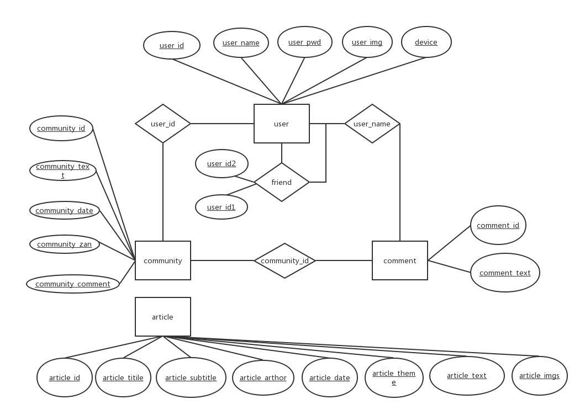

（图二）ER

上图是我们部署在服务器上的MySQL表的ER图，各个表的功能如下：

| 表         | 功能                  |
| --------- | ------------------- |
| User      | 存储用户的id、昵称、密码、头像等信息 |
| Community | 存储朋友圈说说的相关信息        |
| Comment   | 存储评论信息              |
| Article   | 主页文章的数据信息           |

####   安卓本地数据库

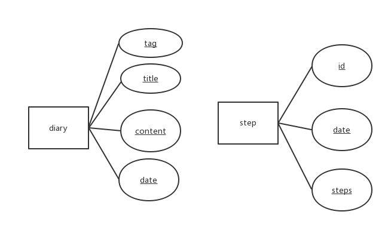

（图三）ER图

上图是我们存储在安卓本机数据库中的表：

| Diary | 存储用户写下的日记信息 |
| ----- | ----------- |
| Step  | 记录下用户每天的步数  |

 

## 四、        业务结构

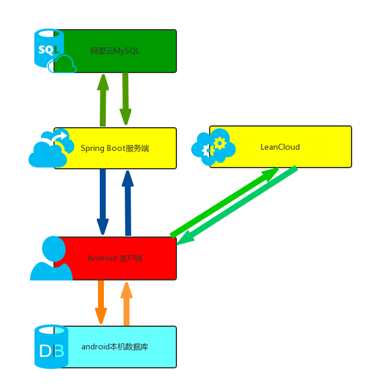

（图四）结构图

图四是我们整个业务的逻辑层，我们将日记、每日步数等基本的信息存储到android本机的数据库中，将其他信息存放到云服务器的MySQL数据库，主要目的是为了学习如何使用不同类型的数据库存储数据；

我们后端服务使用Springboot实现，并且已经部署到我们的阿里云服务器上，同时我们还使用了第三方的LeanCloud，使用了他们提供的即时通信和数据推送服务。

## 五、        代码架构

### MVP架构

除了个别模块由于时间原因采取MVC的方式之外，我们的项目大多采用MVP的模式构建。对于Android来说，MVP的model层相对于MVC是一样的，即各种java bean，还有一些类似repository类就对应于model层；而activity和fragment不再是controller层，而是纯粹的view层，所有关于用户事件的转发全部交由presenter层处理。

mvp架构图如下图所示：

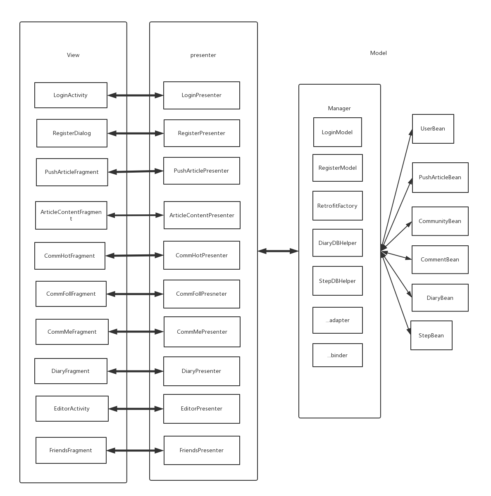

 

### 类图继承

#### Fragment

由于项目中多个fragment的处理方式都具有共同点，于是我们用设计模式的办法将这些方法构造成父类，简化了大量的操作，这里给出部分Fragment继承图，类图关系如下：

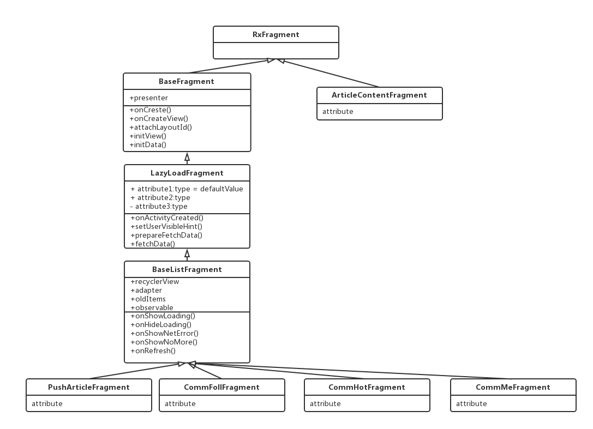

#### Presenter

Presenter的继承和Fragment基本相似，如图：

#### 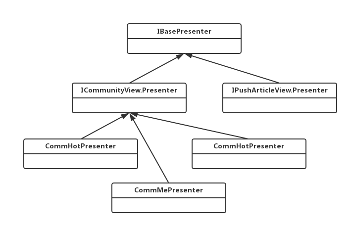

## 六、        功能实现

### 登录/注册

如下图所示，用户注册时要求输入验证码，验证码随机生成，并将密码加密后存到数据库中；登录时将获取的密码加密后再与数据库对比：

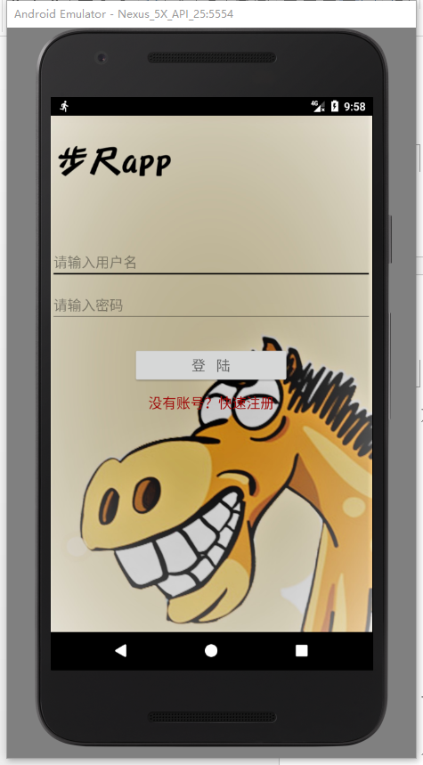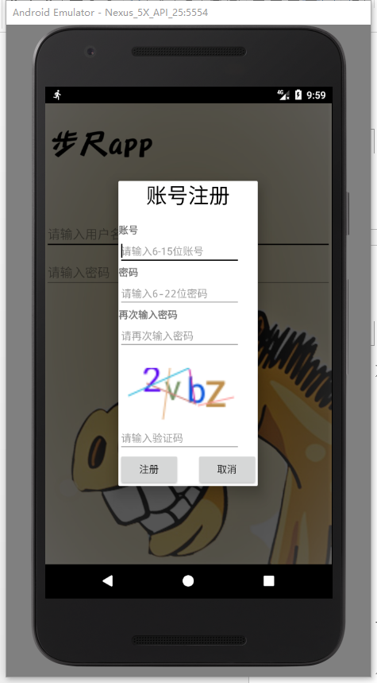

### 主页文章

主页的文章推送不论用户是否登录，都能显示出来，点击文章就能打开相应的浏览内容的界面。我们在开发的时候，实现了一种数据源绑定两种视图类型，主要是为了区分有封面的文章和没有封面的文章。实际上我们数据库里的数据全都是带有封面的，因此几乎都是有封面的视图；

浏览文章的页面是通过Webview加载html生成的，由后端发送给前端的数据生成html。页面实现了ScrollBar的移动时顶上图片折叠、标题从图片到toolbar的切换、点击toolbar回到顶部的动画。              

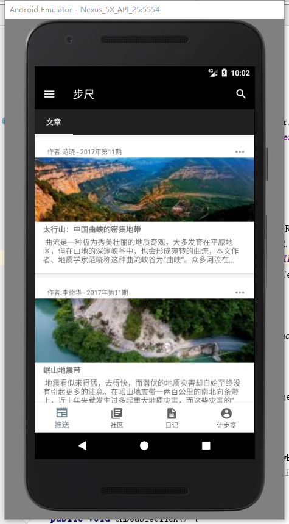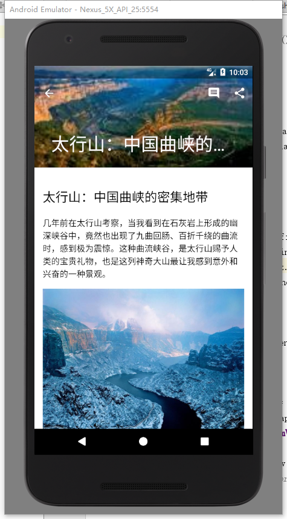

### 朋友圈

未登录的情况下，用户只能看到热门朋友圈的信息，登陆之后，才能看到我关注的和我的说说这两个页面中的内容。用户可以给说说点赞、评论，也可以发表和删除自己的说说：

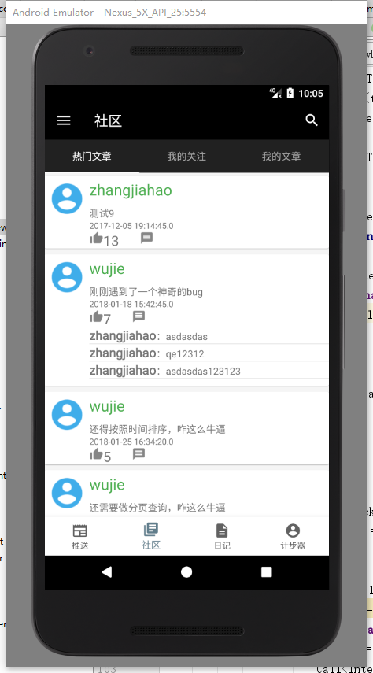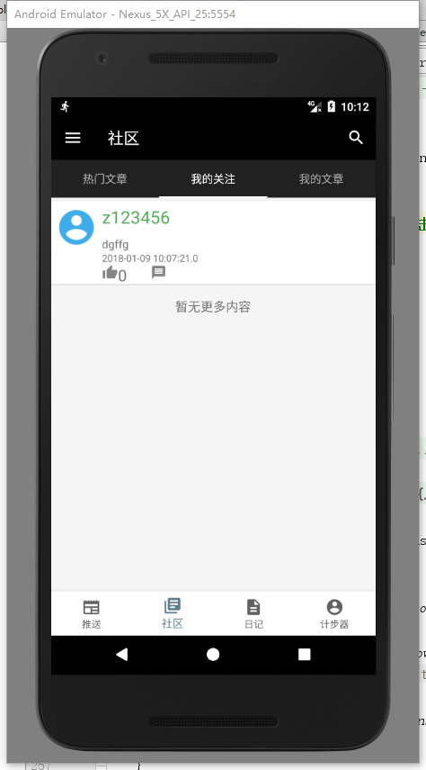

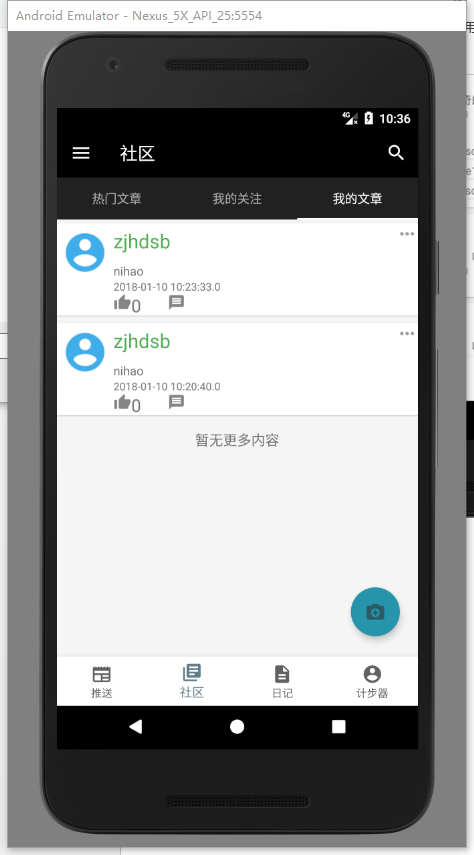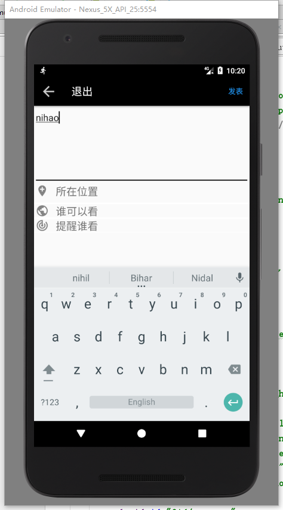

### 搜索

分两种类型，一种是搜索用户，输入用户名进行搜索，之后可以发送好友请求；另一种是根据标题搜索文章，点击搜索结果可以跳转到文章详情页面：

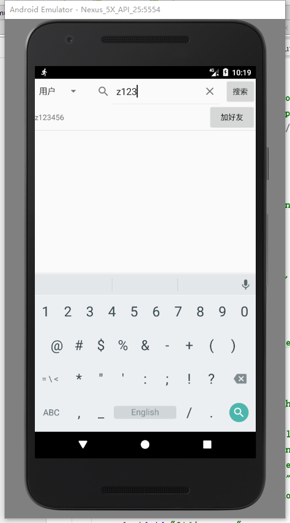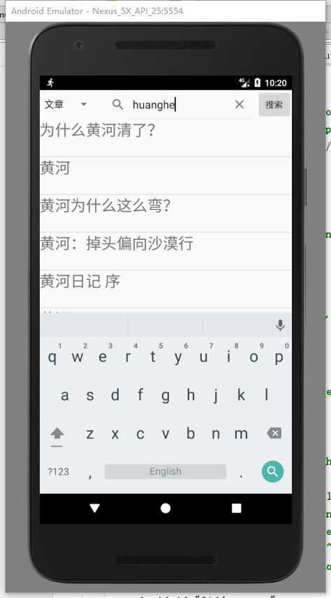

### 即时聊天

我们使用了LeanCloud提供的即时通讯服务，调用了它们的ChatKit组件。调用时，我们通过将需要建立对话的两人的用户id传送给LeanCloud服务端，就能建立两人的实时通讯，并打开对话页面：

​       下图中的联系人页面是需要我们自己定义的，界面中实现了一个自定义的view---字母表，并根据用户名字母顺序进行排序，用户点击右侧字幕，界面会滚动到相应位置：

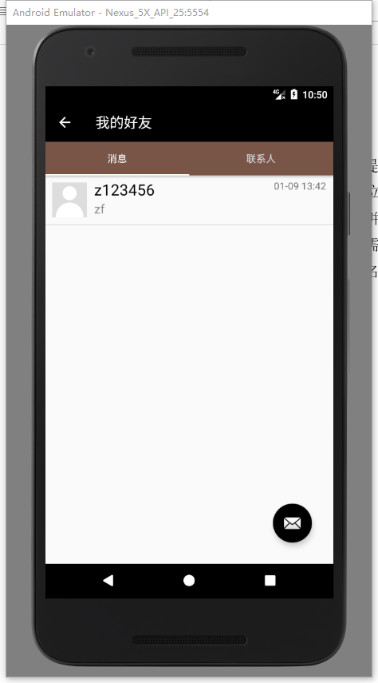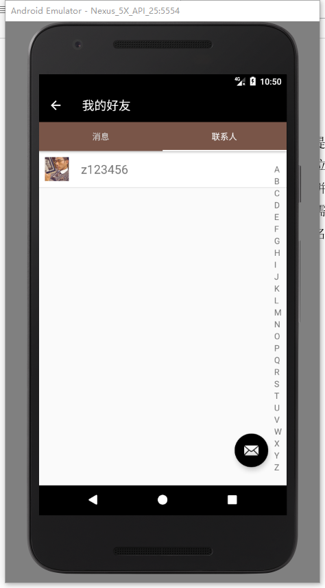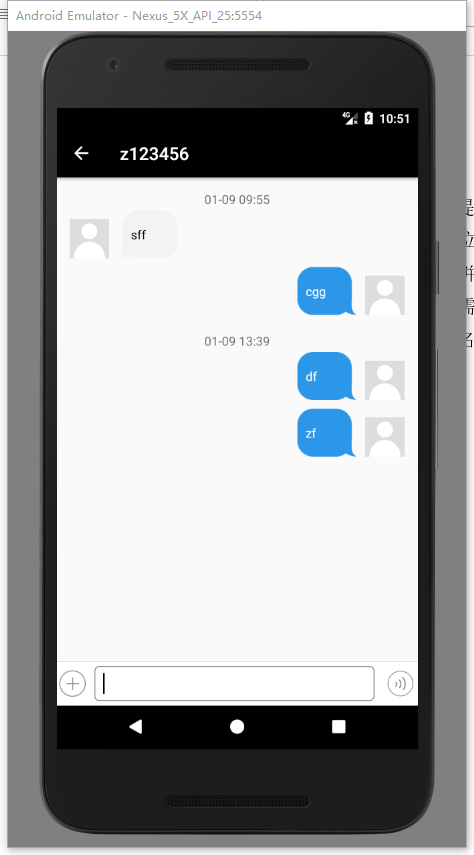

### 消息推送

之前虽然打算使用MQTT来实现推送功能，但是做到最后实在没有时间了，而且在做即时通讯的时候发现LeanCloud也提供推送的服务，于是就拿来用了。

我们通过调用LeanCloud的推送服务，实现用户在发送好友请求的时候，将请求推送发送给对方设备的功能。接收到了别人的好友请求通知后，在同意页面里点击同意，即可在好友列表里看到新的好友了：

​                            下图为用户zjhdsb接收到x123456的好友请求的情况：

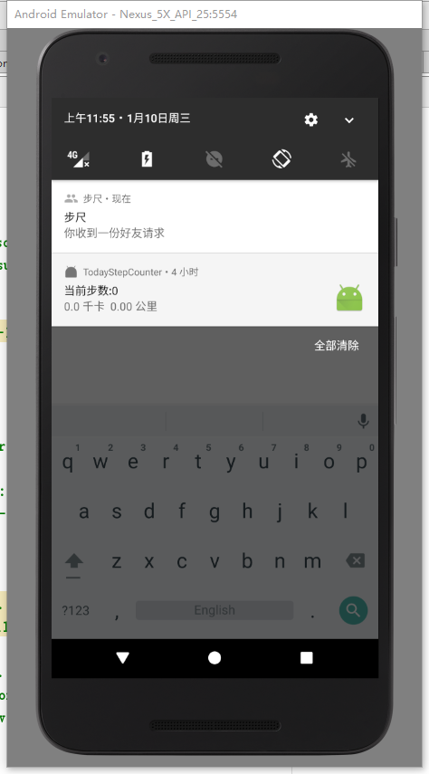

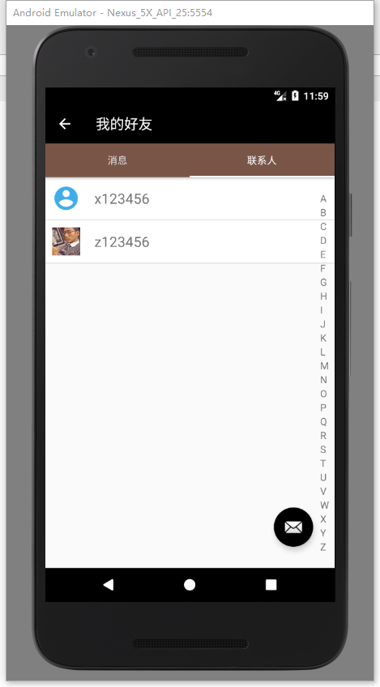

### 日记

日记的存储是使用本地数据库实现的，使用SQLite数据库实现。用户可以新增和修改日记，由于时间原因，日记模块并没有完全完善，没有实现删除功能，修改日记的时候会保留原有的日记，新建一个新的日记；

在编辑日记的界面，我们通过自定义View实现了一个带有分割线的编辑控件：

### 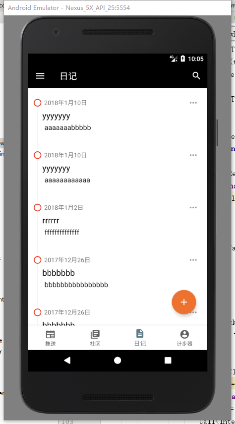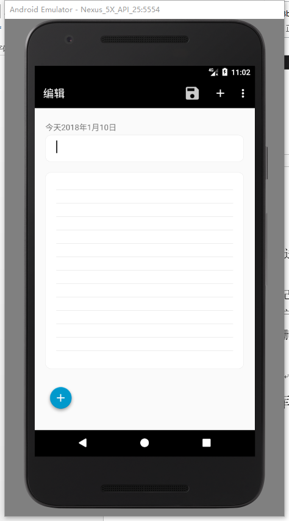

### 计步器

用户每天的步数信息也是存储在android本地的，和日记不同的是，这里使用的是LiteOrm数据库，主要也是为了多尝试不同的东西。计步的实现是通过开启后台的服务，调用系统的加速度传感器或者计步传感器(我们先判断手机上传感器的类型，再选择需要使用的传感器)，后台服务会每隔一段时间存储用户的步数，并采取了一种比较复杂的算法来判断用户有没有在正常走路，App开启的时候将存储的步数发送给主线程，主线程获取到步数之后再显示到界面并存到android数据库里，并将信息通知给用户。

由于下面截图是使用的android虚拟机，虚拟机没有传感器的功能，所以只能显示每天的步数都为0：

 

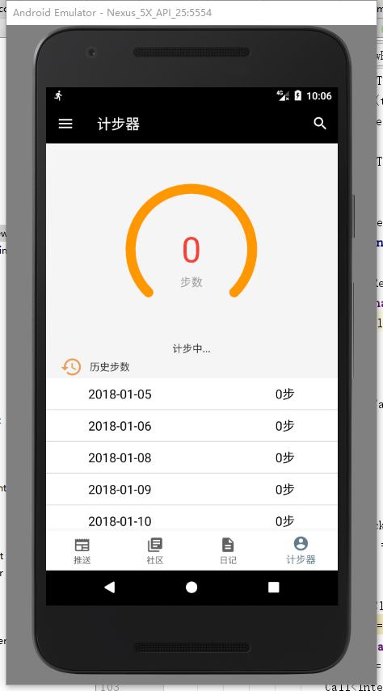

## 七、        开源库

由于项目中使用到的开源库较多，这里不详细说明，只选其中一部分重要的说明一下：

1.        material Design: 我们的App的控件基本上都是用这个风格来实现的，而且也自定义了许多的View，在界面上花了较多时间；

2.        Glide V4图片加载库，app中所有的图片加载都是通过这个库实现的，一开始我们使用的是v3版本的，后来更新到了v4版本，这两个版本的差异还是蛮大的；

3.        网络请求：Retrofit，网络请求都是用retrofit2实现的；

4.        简化版 Adapter：MultiType，使用这个库实现了recyclerView的一种数据源绑定两种视图，或两种数据源绑定同一个视图的操作。   

5.        ChatKit：这是LeanCloud提供的第三方组件，用来实现好友之间的即时通讯。

6.        avoscloud-push: LeanCloud消息推送服务，用来实现好友请求信息的推送。

7.        GalleryPick, Luban:这两个库分别用来实现上传图片是选择图片和将图片压缩上传的操作。

## 八、        小结

由于我们两个人都是android的初学者，而这个项目本身用例繁多，所以这次android课程项目对于我们两个人来说是有一定难度的，而且工作量也挺大的。不过我们一边学一边做，相互合作相互帮助，最终实现了大部分的用例，虽然有些地方还有瑕疵，但是我们两个人不断地努力，感觉收获到了非常多的东西。一开始的时候为了实现一些自定义View，以及搭建好整个项目的MVP架构，也是花费了不少时间。最后，尽管学到了很多东西，android这一领域还有很多很多东西需要我们去接触、学习。这次android项目，是我们的android第一个项目，我们以后会更多的去学习，开发更多的项目。